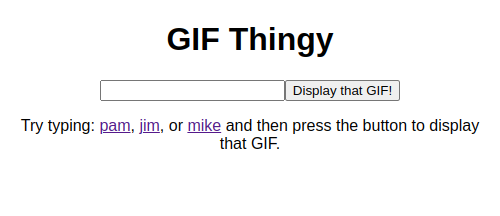

# GIF Thingy
A thingy to load up a GIF for copying to the clipboard, so you can paste it in a chat. My friend mentioned something like this would be cool when I told him I was learning javascript, and so I built it!

**Link to project:** https://www.andyglover.io/gif-thingy/

## How It's Made:

**Tech used:** HTML, CSS, JavaScript

You can fork this! How to use it:
1. Put your GIFs in the "gifs" directory
2. Type the name of the .GIF you want to load (without the extension) into the form on index.html.
3. Click enter and your GIF appears on the page!

## Optimizations

I'd like to learn how to make this project detect what GIF files are present in the directory, and then display thumbnails of them on the page.

## Lessons Learned:

This project gave me some good practice with:
- Arrow functions
- Event listeners
- Setting attributes
- Template literals
- Query selectors
- Form submit and the preventDefault function

## Examples:
Here's a few more repositories of mine you might like to check out:

**ANDYGLOVER.DEV:** https://github.com/andyglover/andyglover.dev

**Calculator:** https://github.com/andyglover/odin-calculator

**Rock Paper Scissors:** https://github.com/andyglover/odin-rock-paper-scissors

**Admin Dashboard:** https://github.com/andyglover/odin-project-admin-dashboard

**ANDYGLOVER.IO:** https://github.com/andyglover/andyglover.github.io